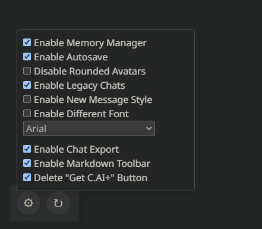
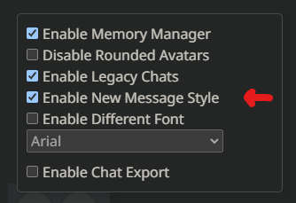
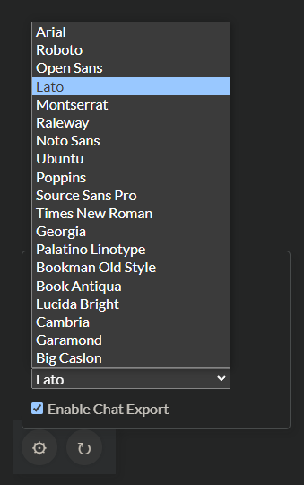

# c.ai-addons
Enhance your Character.ai experience with a set of useful features and tools to make your interactions smoother and more personalized. This extension is a collection of handy add-ons designed to empower your conversations and improve the user interface.

## Installation
1. Download the latest Manifest3-based release from the [releases page](https://github.com/LyubomirT/c.ai-addons/releases).
2. Extract the archive.
3. Open your preferred web browser and navigate to the extension manager.
4. Enable developer mode (if not already enabled or if needed).
5. Click on "Load unpacked" and select the extracted folder.

## Installation (Firefox)

For Firefox, installation steps differ a bit. Here's how to install the extension on Firefox:

1. Download the latest release for Firefox from the [releases page](https://github.com/LyubomirT/c.ai-addons/releases).
2. Open Firefox and go to `about:extensions`, basically the extensions page.
3. Click on the gear icon in the top right corner, and select "Install Add-on From File".
4. Select the downloaded `.xpi` file, and click "Open".
5. Click "Add" in the prompt that appears.

# Usage

## Settings

In the bottom left corner of the webpage (it's a bottom toolbar on mobile), there is a button, with a gear icon. Clicking on it will open the extension settings.

## Memory Manager

The memory manager is a tool that allows you to manually create "Memory Strings", that prevent the chatbot from forgetting things when
inserted into your message. This is useful for things like names, locations, etc. that you want to be remembered throughout the conversation.

The Memory Manager requires the "Enable Memory Manager" option to be enabled in the extension settings.

**Preview**

### Creating a Memory String

A memory string consists of "AI memories" and "User facts". To add a new AI memory, click on the "Add memory" button in the "Character Memory" section. To add a new user fact, click on the "Add fact" button in the "User Memory" section. You can preview your memory string in the box above:

There are also other Memory String controls, like the ones shown below:

### Inserting a Memory String

Below the Memory String controls, there is a button, saying "Insert Memory String". Clicking on it will insert the memory string into the message box. NOTE that it's recommended to hit Shift+Enter while focusing on the messagebox after inserting it, because otherwise it might break the message.

If you don't want to use the button, simply copy-paste the memory string from the previewer into the message box.

### Importing an Existing Memory String

If you already have a memory string, you can import it by clicking on the "Import Memory String" button. This will open a prompt, where you can paste your memory string. After pasting it, click on "Confirm" and it will be imported, if it matches the standard memory string format.

### Automatically Generating a Memory String with AI

If you don't want to manually create a memory string, you can use the "Generate Automatically" button. This will automatically generate a memory string based on the current chat state. The process can sometimes be a bit slow, and it's not 100% accurate.

You can also switch between the "Fast" and "Normal" models. Fast can save you some time, but it's not as accurate as the normal model, while the normal model is more accurate, but slower.

### Opening or Closing the Memory Manager

In the top right corner of the webpage, there is a button, with an arrow. Clicking on it will open the memory manager, and clicking on it again will close it.

### Note

In order to use the memory manager, you are required to have a Cohere API key. You can get one by signing up [here](https://cohere.com/). After that, you'll be redirected to the dashboard, where you can find your API key in the API keys section. Copy it, and paste it in the "Cohere API Key" input in the Memory Manager.

The API Key is totally free, and is not exposed to anyone, except you. We highly recommend you to not share your API key with anyone, as it can be used to use Cohere on your behalf.

## Legacy Chats

In a recent update, Character.AI changed the way you chat, as well as removing a few neat features. This addon brings back the old chat, as well as the features that were removed.

### Enabling Legacy Chats

First of all, you need to enable the "Enable Legacy Chats" option in the extension settings. After that, you need to refresh the page, and then you need to click the "Spin" button in the toolbar, while being on a chatting page.

## Non-Rounded Avatars

This addon removes the rounded corners from the avatars. It can be enabled by enabling the "Disable Rounded Avatars" option in the extension settings.

## Hiding / Showing the Toolbar (Mobile)

The toolbar covers a lot of space in the bottom part of the screen on mobile devices. You can easily hide it by clicking the three-dot button in the top right corner of the page. This will hide the toolbar, and you can show it again by clicking the same button.

## New Message Style

This addon changes the style of the messages (sent by both the AI and the user). It can be enabled by enabling the "Enable New Message Style" option in the extension settings. Basically, it makes the messages look more visually appealing and easier to read.

## Font Override

If you don't like the default font, you can change it by enabling the "Enable Different Font" option in the extension settings. After that, you can select a font from the dropdown menu. The currently available fonts are:

- Arial
- Roboto
- Open Sans
- Lato
- Montserrat
- Raleway
- Ubuntu
- Noto Sans
- Source Sans Pro
- Times New Roman
- Georgia
- Palatino Linotype
- Bookman Old Style
- Book Antiqua
- Lucida Bright
- Cambria
- Garamond
- Big Caslon

You will need to refresh the page after changing the font. Also, please notice that the font might have a different width, and might slightly break the UI (but it's not that bad).

## Chat Exporting

This addon allows you to export your chat history. It can be enabled by enabling the "Enable Chat Exporting" option in the extension settings. After that, you can click on the "download" button in the toolbar, and it will download a .txt file with your chat history, using the same format as the one used by the chat scanner.

First of all, you need to enable the "Enable Chat Exporting" option in the extension settings.

After that, you need to refresh the page, and then you will see a new button in the toolbar, with a download icon. Clicking on it will download a .txt file with your chat history. The file will be named "messages.txt".

# Contributing

Contributions are welcome! If you want to contribute, you can either open an issue, or create a pull request. If you want to create a pull request, please make sure to follow the [contribution guidelines](CONTRIBUTING.md).

# License

This project is licensed under the [GNU General Public License v3.0](LICENSE).